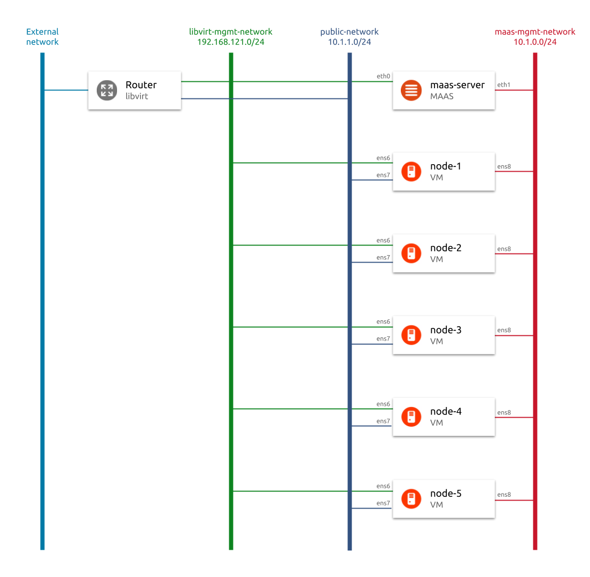
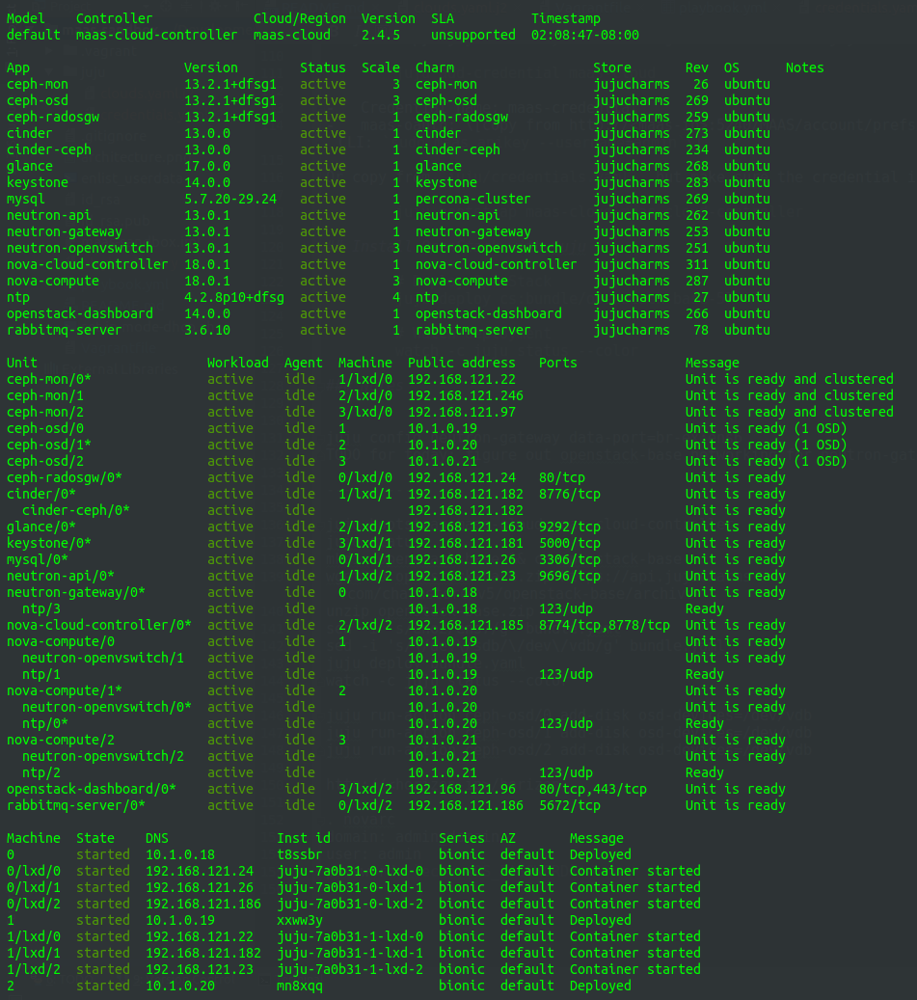

# Introduction

This set of scripts automates deployment of sandbox MAAS cluster according to the following architecture diagram.

## Pre-requisites

Make sure that you have installed Vagrant and Ansible.

# How to deploy MAAS Sandbox

1.  Deploy a virtual machine for hosting MAAS server and wait for Ansible to finish provisioning it.

        (vagrant-host)$ vagrant up maas-server --provider libvirt
    
2.  SSH to maas-server to learn IP assigned by libvirt

        (vagrant-host)$ vagrant ssh maas-server
        vagrant@maas-server:~$ echo "http://$(ip a show eth0 | grep -w inet | awk '{print $2}' | cut -d '/' -f 1):5240/MAAS"
    
3.  Open web browser and login to MAAS using URL from the previous step. Username: `admin`, password: `admin`.

4.  Skip through "Welcome to MAAS".

5.  Enable DHCP on fabric-1 VLAN (via CLI or web GUI). 

    **CLI (run the following commands on maas-server):**

        # Login to MAAS
        maas login admin http://localhost:5240/MAAS $(sudo maas apikey --username admin)
        
        # Create reserved dynamic range for maas-mgmt-network
        maas admin ipranges create type=dynamic start_ip=10.1.0.200 end_ip=10.1.0.254
        
        # Read Fabric ID of maas-mgmt-subnet
        maas admin subnet read 10.1.0.0/24
        
        # Provide DHCP for this maas-mgmt-network subnet
        maas admin vlan update 1 untagged primary_rack=maas-server dhcp_on=True

    **Web GUI:**

    Select `Subnets` → `untagged` VLAN for fabric-1. Click `Take action` → `Provide DHCP` → `Provide DHCP`. Make sure that `Gateway IP` is **not** configured.

    Make sure that dhcpd is running. In web GUI, go to `Controllers` → `maas-server.maas` and check if there is a green tick next to dhcpd. If not, reboot maas-server.

6.  Set distro for commissioning and deploying.

    Run on maas-server:

        # Login to MAAS (optionally, if you rebooted maas-server in previous step) 
        maas login admin http://localhost:5240/MAAS $(sudo maas apikey --username admin)
    
        maas admin maas set-config name=default_distro_series value=xenial
        maas admin maas set-config name=commissioning_distro_series value=xenial

7.  Add maas-server's public key to `authorized_hosts` on KVM host. This is necessary for MAAS to be able to control power of the machines on KVM host. 
 
        (vagrant-host)$ cat id_rsa.pub >> ~/.ssh/authorized_keys

8.  Now that DHCP in MAAS is enabled, deploy PXE machines. They will be controlled by MAAS.

        (vagrant-host)$ vagrant up node-1 node-2 node-3 node-4 node-5 --provider libvirt
    
    Observe how machines are booting via PXE and enlisting in MAAS.

9.  Commission enlisted nodes in MAAS.
 
    When nodes finish enlisting and are in a `New` status, commission them (via CLI or web GUI).

    **CLI (run on maas-server):**
 
        maas admin machines accept-all

    **Web GUI:** 

    In `Machines` menu, select all machines and click `Take action` → `Commission` → `Commission 5 machines`. 
    
    Observe how machines are commissioned in both virt-manager's VM window and in MAAS: see tab `Commissioning` for each node.

10. Post-commissioning configuration.

    *Note: before running the following, make sure that node-1 has ens7 interface configured, i.e. it has defined fabric, vlan and subnet. If not, manually configure it so that it belongs to public-network (subnet 10.1.1.0/24).* 

    Update machines' interfaces connected to libvirt-mgmt-network so that they are handled by libvirt's DHCP. Run the following on maas-server.

        ./set-ip-mode-dhcp.sh node-1 fabric-0 192.168.121.0/24
        ./set-ip-mode-dhcp.sh node-2 fabric-0 192.168.121.0/24
        ./set-ip-mode-dhcp.sh node-3 fabric-0 192.168.121.0/24
        ./set-ip-mode-dhcp.sh node-4 fabric-0 192.168.121.0/24
        ./set-ip-mode-dhcp.sh node-5 fabric-0 192.168.121.0/24
        
        ./set-ip-mode-dhcp.sh node-1 fabric-0 10.1.1.0/24
        ./set-ip-mode-dhcp.sh node-2 fabric-0 10.1.1.0/24
        ./set-ip-mode-dhcp.sh node-3 fabric-0 10.1.1.0/24
        ./set-ip-mode-dhcp.sh node-4 fabric-0 10.1.1.0/24
        ./set-ip-mode-dhcp.sh node-5 fabric-0 10.1.1.0/24

11. (Optional) Deploy Ubuntu on a machine.

    Select `Take action` → `Deploy` on selected machine to deploy Ubuntu. Once the machine is in state `Deployed`, you can ssh to it from maas-server. In order to learn the IP address assigned by MAAS to this machine, check `DNS` menu.

# Deploy OpenStack on top of MAAS    

## Install and configure Juju

To manually install and configure Juju on maas-server, run the following commands:

        sudo snap install juju --classic
        juju add-cloud
        
-   Cloud type: maas
-   Cloud name: maas-cloud
-   API endpoint url: http://10.1.0.1:5240/MAAS

        juju add-credential maas-cloud
        
-   Credential name: maas-credential
-   maas-oauth: \[copy from http://<maas-ip>:5240/MAAS/account/prefs/ or fetch via CLI: `sudo maas apikey --username=admin`\]

Alternatively, the above can be automated with Ansible, and that is the approach I choose. See playbook.yml for details 
such as generation of clouds.yaml and credentials.yaml.

Then, bootstrap Juju to create a Juju Controller:

        juju bootstrap maas-cloud maas-cloud-controller
        
## Install OpenStack with Juju

For OpenStack deployment, I choose [openstack-base](https://jujucharms.com/openstack-base/) #57 bundle.

        # Download and extract bundle
        wget https://api.jujucharms.com/charmstore/v5/openstack-base/archive -O archive.zip
        unzip archive.zip 
        rm archive.zip
        
        # Customize bundle to fit the architecture
        sed -i 's/eno2/ens7/g' bundle.yaml
        sed -i 's/\/dev\/sdb/\/dev\/vdb/g' bundle.yaml
        
        # Deploy OpenStack
        juju deploy bundle.yaml
        
        # Watch deployment
        watch -c juju status --color
        
Once the deployment is finished, Juju will report all units in `active` state.

## Accessing Openstack

To find out what is the admin password and default domain for logging into OpenStack's Horizon, run the following
commands: 

        source novarc
        env | grep OS_

Run this command on maas-server to get the URL for OpenStack dashboard:

        echo "http://$(juju run --unit openstack-dashboard/0 'unit-get public-address')/horizon" 

