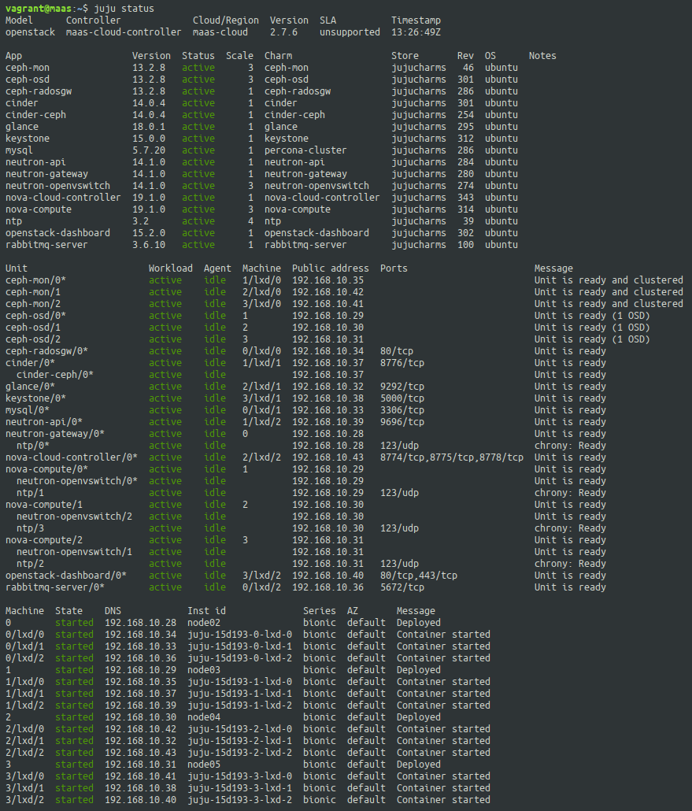
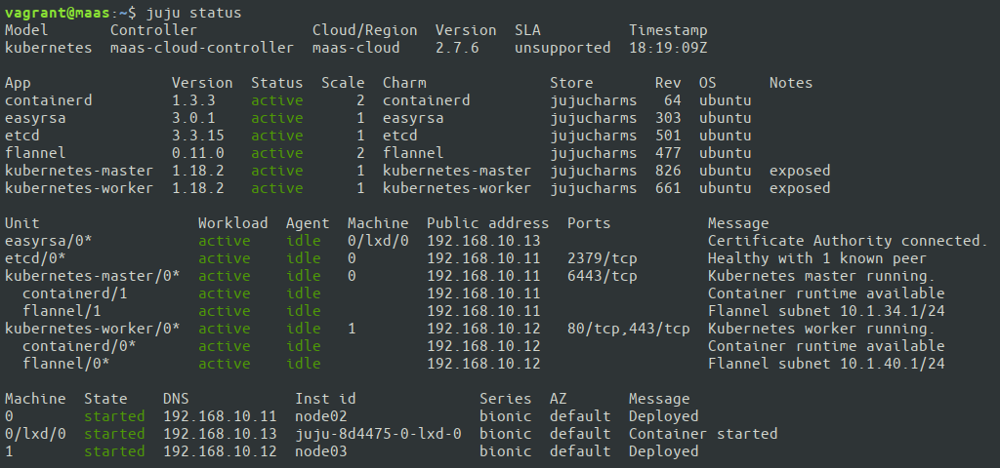

# Introduction

This set of scripts automates deployment of virtual MAAS sandbox. A virtual MAAS
server and nodes managed by MAAS are deployed according to the following 
architecture diagram.

## Pre-requisites

Make sure that you have installed Vagrant and vagrant-libvirt plugin. 
For example, on Ubuntu 18.04, you can run:
        
    sudo apt install -y virt-manager vagrant vagrant-libvirt
    sudo reboot

# How to deploy MAAS Sandbox

1. Update the 'Configuration section' at the top of `Vagrantfile` so that it 
matches your environment.

2.  Add MAAS's public key to `authorized_hosts` on your host. This is 
necessary for MAAS to be able to control power of the Cloud Nodes.

    Vagrant will automatically provision MAAS with the key that you generate in 
    this step. 

        (host)$ ssh-keygen -q -t rsa -f ./id_rsa -N ""
        (host)$ cat id_rsa.pub >> ~/.ssh/authorized_keys

3.  Deploy a virtual machine hosting MAAS server and virtual machines acting as 
Cloud Nodes. Wait until Vagrant finishes provisioning.

        (host)$ vagrant up --provider libvirt
    
4.  Open web browser and login to MAAS using the following URL. Username: 
`root`, password: `root`.
    
    http://localhost:5240/MAAS/

5.  Click "Go to dashboard" button.

6.  Wait for machines to finish Commissioning.
    
    Observe how machines are booting via PXE and commissioning in MAAS. When 
    commissioning finishes, all nodes will report `Ready` status.

7. (Optional) Deploy Ubuntu on a machine.

    Select `Take action` → `Deploy` on selected machine to deploy Ubuntu. Once 
    the machine is in state `Deployed`, you can ssh to it from `maas` node. In 
    order to learn the IP address assigned by MAAS to this machine, check 
    `Network` tab for a specific machine.

# Deploy OpenStack on top of MAAS    

## Bootstrap Juju controller

Juju client has already been installed on `maas` machine. Juju configuration files
`clouds.yaml` and `credentials.yaml` have also been automatically provisioned 
by Vagrant.

Now you can bootstrap a Juju Controller on one of the Cloud Nodes (typically 
`node01`):

    (host)$ vagrant ssh maas
    (maas)$ juju bootstrap maas-cloud maas-cloud-controller
        
## Deploy OpenStack with Juju

For OpenStack deployment, I have chosen OpenStack Stein on Ubuntu Bionic
[openstack-base #61](https://jaas.ai/openstack-base-61) bundle from the official 
Juju charm store.

    # Download the bundle
    (maas)$ charm pull openstack-base-61 ~/openstack-base

    # Customize bundle to fit the architecture
    (maas)$ sed -i 's/eno2/ens7/g' openstack-base/bundle.yaml
    (maas)$ sed -i 's/\/dev\/sdb //g' openstack-base/bundle.yaml

    # Deploy OpenStack bundle
    (maas)$ juju add-model openstack
    (maas)$ juju deploy ./openstack-base/bundle.yaml

    # Watch the deployment
    (maas)$ watch -c juju machines --color
    (maas)$ watch -c juju status --color
        
Once the deployment is finished, Juju will report all units in `active` state.

## Accessing Openstack

Get the IP address of OpenStack Dashboard and construct the URL to access it.

    (maas)$ DASHBOARD_IP=$(juju run --unit openstack-dashboard/0 'unit-get public-address')
    (maas)$ echo "http://${DASHBOARD_IP}/horizon/"

Run the following commands to find out what is the admin password for logging 
into OpenStack dashboard: 

    (maas)$ source openstack-base/openrc
    (maas)$ env | grep OS_PASSWORD

Login with:

-   Domain: `admin_domain`, 
-   User: `admin`, 
-   Password: as in `$OS_PASSWORD` environment variable.

You can also interact with OpenStack using CLI, e.g.:

    (maas)$ sudo snap install openstackclients --classic
    (maas)$ openstack catalog list

Check out more examples on how to create networks, images and instances at 
[https://jaas.ai/openstack-base](https://jaas.ai/openstack-base).

# Deploy Kubernetes on top of MAAS    

If you haven't bootstrapped a Juju controller yet, go to the 
[Bootstrap Juju Controller](#bootstrap-juju-controller) section above and run 
the commands.

Before deploying Kubernetes, destroy your `openstack` juju model, if you had 
previously deployed OpenStack.

    (maas)$ juju destroy-model openstack

For Kubernetes deployment, I have chosen 
[kubernetes-core #1036](https://jaas.ai/kubernetes-core-1036) bundle from the 
official Juju charm store.

    # Download the bundle
    (maas)$ charm pull kubernetes-core-1036 ~/kubernetes-core

    # Customize bundle to fit the machines you actually have
    (maas)$ sed -i 's/cores=4/cores=2/g' kubernetes-core/bundle.yaml

    # Deploy Kubernetes bundle
    (maas)$ juju add-model kubernetes
    (maas)$ juju deploy ./kubernetes-core/bundle.yaml

    # Watch the deployment
    (maas)$ watch -c juju status --color

Once the deployment is finished, Juju will report all units in `active` state.

Check out more examples on how to deploy Kubernetes workloads at  
[https://jaas.ai/kubernetes-core](https://jaas.ai/kubernetes-core).

# Deploy Ceph cluster on top of MAAS    

If you haven't bootstrapped a Juju controller yet, go to the 
[Bootstrap Juju Controller](#bootstrap-juju-controller) section above and run 
the commands.

Before deploying Kubernetes, destroy your `openstack` or `kubernetes` juju 
model, if you had previously deployed OpenStack or Kubernetes with 
`juju destroy-model` command.

Example Ceph bundle has been provisioned onto `maas` machine by Vagrant.

    # Deploy Ceph bundle
    (maas)$ juju add-model ceph
    (maas)$ juju deploy ./ceph/bundle.yaml

    # Watch the deployment
    (maas)$ watch -c juju status --color

Once the deployment settles, you can interact with Ceph cluster from any 
`ceph-mon` unit.

    (maas)$ juju ssh ceph-mon/0
    (ceph-mon/0)$ sudo ceph status
